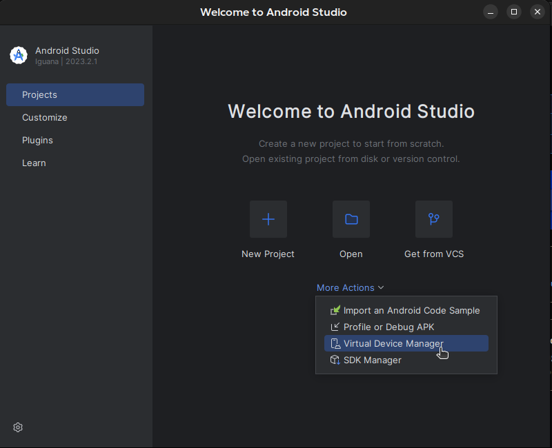
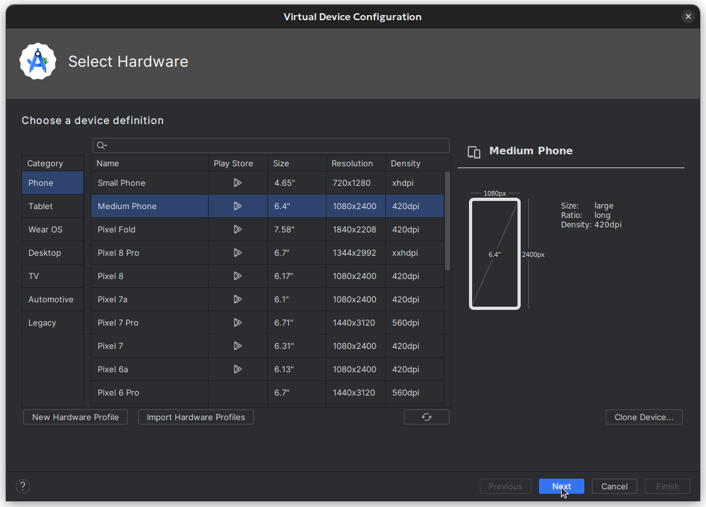
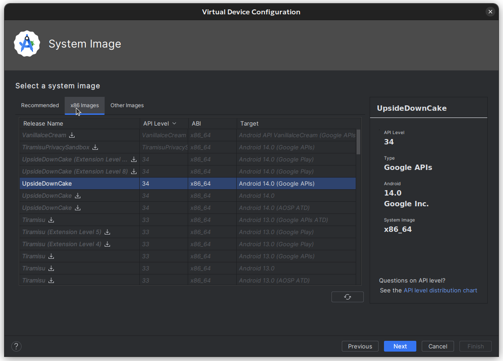

# :iphone: SchoolNexus Mobile

> End-user mobile platform application for SchoolNexus.

This project was scaffolded using [Expo](https://expo.io/).

## Getting Started

```bash
# Install dependencies
npm install
```

There are 3 ways to start the development server:

1. Web browser (recommended)

```bash
npm run web
```

2. Expo Go mobile client

    a. For project admin:

    - Create an [Expo account](https://expo.dev/signup).
    - Login to Expo account and create a new project (suggested slug: `schoolnexus-mobile`).
    - Run the following command, using the Expo project ID retreived in the previous step:

    ```bash
    # Link to Expo project
    eas init --id <expo-project-id>
    ```

    b. For contributors:

    - Create an [Expo account](https://expo.dev/signup).
    - Contact the project admin to be added to the Expo project.
    - Copy the Expo project ID.
    - Run the following command:

    ```bash
    # Link to Expo project
    eas init --id <expo-project-id>

    # You might be warned that the slug does not match. You can ignore this message and enter `y` to continue.
    ```

    - Download mobile app [Expo Go](https://expo.dev/client) on your device and login.
    - Run the following command and scan the generated QR code with the Expo Go app.

    ```bash
    # Start Expo server
    npx expo start
    ```

3. Android Studio emulator

-   Download [Android Studio](https://developer.android.com/studio).
-   Installation:
    1.  Select _**"Custom"**_ installation type.
    2.  Select as follow (Android version must be 9.0 or higher):
        -   Android SDK
        -   Android SDK Platform
        -   Android Virtual Device
    3.  Click on _"Next"_ and _"Finish"_ to complete the installation.
-   Create a new virtual device:
    -   Open Android Studio.
    -   On welcome window, click on _**"More Actions"**_ > _**"Virtual Device Manager"**_.
        
    -   Create new virtual device with the following configurations:
        
        Click _**"Next"**_.
        
    -   Click _**"Next"**_.
    -   On the final screen, _**"Verify Configuration"**_, you can change the device name and select _**"Graphics: Hardware"**_ for better performance.
    -   Click _**"Finish"**_ to create the virtual device.
-   Open the virtual device and wait for it to start.
-   Run the following command in the same directory as this README file to start the development server on the emulator:

```bash
npm run android

# If you encounter warnings about mismatch npm package versions, you can stop the server and run the following command to fix it:
# npx expo install --fix
```

> For iOS simulator, you need to have a Mac computer with Xcode installed. More information can be found [here](https://docs.expo.dev/workflow/ios-simulator/).
